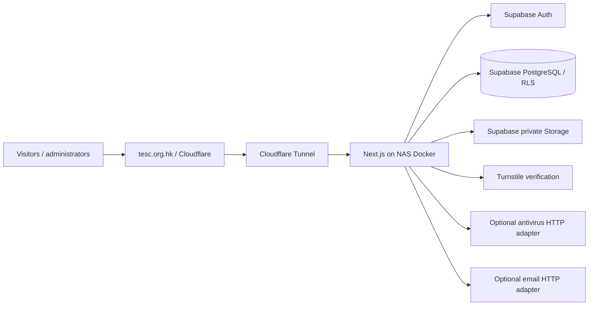

# TESC website foundation

A self-hostable Next.js application for **Theological Education Service Corps Ltd. / 神學教育服務團**. Traditional Chinese is the default language; Simplified Chinese and English share the same application and records.

This delivery contains working application code, reproducible SQL, a CMS, upload/moderation endpoints, automated tests, and Docker configuration. **No TESC Supabase project, NAS, Cloudflare account, DNS record, SMTP provider, or GitHub repository has been configured.** A credential-free local preview shows clearly identified placeholders. Authentication and public submissions fail closed until configured.

## Architecture



The public application uses anonymous database credentials and RLS. Admin requests authenticate the Supabase user server-side, read their role from `profiles`, and use that user's RLS-protected client. Service credentials are limited to server-only media handling, validated public submissions, rate limits, and email delivery bookkeeping. There is no public registration, search engine, payment processor, member paywall, Vercel service, or scheduler.

**Stack:** Next.js App Router, React, TypeScript, Tailwind CSS 4 plus a custom editorial stylesheet, Tiptap rich text, Supabase SSR/Auth/PostgreSQL/Storage, Zod, sanitize-html, Lucide. Pinned dependency resolution lives in `pnpm-lock.yaml`. Node 22 and pnpm 11.25.0 are the reproducible toolchain; all application commands are ordinary package scripts compatible with `npm run`.

## Local development

```sh
corepack enable
corepack prepare pnpm@11.25.0 --activate
pnpm install --frozen-lockfile
cp .env.example .env.local
npm run dev
```

PowerShell: use `Copy-Item .env.example .env.local` instead of `cp` if desired. On systems without npm in PATH, use `pnpm dev`, `pnpm build`, etc. No global Next.js installation is required.

Open `http://localhost:3000/zh-Hant`. Without Supabase configuration the public site remains a read-only placeholder preview. It does not simulate successful uploads, authentication, or email delivery.

```sh
npm run typecheck
npm run lint
npm test
npm run build
npm run start
```

`start` copies public/static assets into the generated standalone directory and starts the standalone Node server. `APP_HOST` defaults to `0.0.0.0`; set it to `127.0.0.1` for a loopback-only preview. `PORT` defaults to 3000. Docker copies these assets during its build instead. Keep `.env.local` available at build/start for local use; production Docker injects runtime values with `env_file`.

## Environment variables

| Variable | Purpose | Secret? |
|---|---|---|
| `NEXT_PUBLIC_SITE_URL` | Canonical origin, allowed form origin, auth callback origin; use `https://tesc.org.hk` in production | No |
| `NEXT_PUBLIC_SUPABASE_URL` | Supabase project URL | No |
| `NEXT_PUBLIC_SUPABASE_ANON_KEY` | Public-safe anonymous API key; security depends on RLS | No |
| `SUPABASE_SERVICE_ROLE_KEY` | Server-only privileged key | **Yes** |
| `CLOUDFLARE_TURNSTILE_SITE_KEY` | Passed to the public widget by the server | No |
| `CLOUDFLARE_TURNSTILE_SECRET_KEY` | Server token verification | **Yes** |
| `RATE_LIMIT_SECRET` | Random secret for HMAC-hashing request identifiers | **Yes** |
| `TRUST_CLOUDFLARE` | Trust `CF-Connecting-IP` only on an exclusively tunnel-reachable origin | No |
| `MAX_PUBLIC_UPLOAD_MB` | Public PDF cap, default 10, clamped to 1–20 MiB | No |
| `MAX_ADMIN_UPLOAD_MB` | Admin upload cap, default/cap 250 MiB | No |
| `CONTACT_RECEIVER_EMAIL` | Configured administrative recipient | Private configuration |
| `CONTACT_WEBHOOK_URL` / `CONTACT_WEBHOOK_TOKEN` | Email-provider adapter endpoint and bearer token | Token: **Yes** |
| `MALWARE_SCAN_URL` / `MALWARE_SCAN_TOKEN` | Antivirus adapter endpoint and bearer token | Token: **Yes** |
| `CLOUDFLARE_TUNNEL_TOKEN` | Optional Compose tunnel container credential | **Yes** |
| `ADMIN_EMAIL` / `ADMIN_DISPLAY_NAME` | One-time first administrator invitation | Remove after use |

Generate `RATE_LIMIT_SECRET` with a password manager or `node -e "console.log(require('crypto').randomBytes(32).toString('hex'))"`, store it privately, and never commit `.env` files. Neither infrastructure secrets nor mail/scanner/tunnel credentials are editable in the CMS. Rebuild after changing the canonical domain because static `robots.txt` uses the build environment; alternatively provide `NEXT_PUBLIC_SITE_URL=https://tesc.org.hk` when building. The default is already `https://tesc.org.hk`.

## Supabase setup and reproducible migrations

1. Create/select the intended Supabase project and record its URL, anonymous key, and service key securely.
2. Using an approved Supabase CLI installation, link the project and apply the migration:

   ```sh
   supabase link --project-ref YOUR_PROJECT_REFERENCE
   supabase db push
   ```

   The checked-in migration is `supabase/migrations/202609280001_foundation.sql`. The local CLI defaults in `supabase/config.toml` disable signup; configure the hosted project separately. Alternatively apply this exact file with `psql "$DATABASE_URL" -v ON_ERROR_STOP=1 -f supabase/migrations/202609280001_foundation.sql`. Do not manually reconstruct tables in the dashboard.
3. Disable public signup in Supabase Auth. Set Site URL to `https://tesc.org.hk`; allow `https://tesc.org.hk/auth/confirm`. Add localhost only to a development project.
4. Configure production SMTP and appropriate Auth rate limits. Configure invite/recovery email links to carry a token hash to the server:

   Invite template link:
   `{{ .SiteURL }}/auth/confirm?token_hash={{ .TokenHash }}&type=invite`

   Recovery template link:
   `{{ .SiteURL }}/auth/confirm?token_hash={{ .TokenHash }}&type=recovery`

   The callback validates only invite/recovery OTPs (or a PKCE code) and redirects to a fixed local password page. It does not accept arbitrary redirect URLs.
5. Configure `.env.local` or Docker `.env`, then run the first-admin procedure below.
6. Confirm all three Storage buckets are private, RLS is enabled, and no pre-existing broad policies grant anonymous access to these tables/buckets. Use a fresh project or review existing grants before deploying this migration into a shared project.

### Schema

| Table / view | Data and access |
|---|---|
| `profiles` | Auth user FK, `editor` / `super_admin`; own profile readable, role administration super-admin only |
| `content_entries` | Unified typed CMS records, UUID, `(kind,slug)` unique, multilingual JSONB, rich text, type-specific `data`, publish time, ordering, soft deletion, attribution |
| `media_items` | Provider-neutral bucket/path, MIME/size, original sanitized name, scan status, creator |
| `community_resources` | Submission, media FK, multilingual metadata, private contributor data, moderation/publication/scan status, approval attribution |
| `public_resources` | Security-barrier view exposing **only** approved, published, clean, non-deleted records with no contributor email/name |
| `contact_submissions` | Private enquiry, consent, delivery state, resolved state |
| `audit_events` | Actor, entity, action, time; content/resource changes recorded by triggers, explicit external-scan and role actions recorded server-side |
| `rate_limits` | Atomic persistent hourly request/byte counters; no anonymous or authenticated direct access |

`content_entries.kind` covers pages, people, ministries, videos, courses, course/resource categories, projects, project sections/documents, prayer letters, contact data, donation method, and site settings. This deliberate shared model avoids maintaining fifteen nearly identical CRUD systems. `src/lib/domain.ts` validates type-specific JSON, and `src/lib/modules.ts` defines staff-friendly fields. Actual relational boundaries (Auth users, files, submissions) have foreign keys. Media references in `data` are UUIDs validated by the application, rather than database foreign keys; the admin delete route checks references before removing a media record. Do not delete referenced media directly in SQL.

Public `content_entries` RLS requires `status='published' AND published_at<=now() AND deleted_at IS NULL`. Anonymous clients cannot insert records directly. Public submissions go through the validated server endpoint; granting direct anonymous table inserts would bypass CAPTCHA and quotas.

Editors can manage content, people, courses, prayer letters, project content, resources and enquiries. They cannot change `settings`, `profiles`, or media scan results. Super administrators can manage roles and attest an external malware scan. No policy trusts a frontend role value. The `public_resources` view intentionally runs with its owner’s privileges to project a narrow safe set from the otherwise private resource table.

### Storage and migration boundaries

- `public-assets`: private asset bucket available for branding/public image workflows, 20 MiB.
- `public-resources`: private approved-document bucket available for future lifecycle moves, 20 MiB.
- `admin-media`: private active upload bucket, PDF/image/MP4, up to 250 MiB.

All uploads initially stay in `admin-media`, including approved resources. We intentionally keep approved objects private instead of copying them into a public bucket: hiding/unpublishing a record then revokes new download links. `/api/media/[id]` checks current visibility and issues a **60-second** signed URL. Already-issued signed links remain valid until expiry; existing browser downloads cannot be recalled. `?download=1` requests attachment disposition; the ordinary URL allows browser PDF viewing. No login is required for an approved public file.

`src/lib/storage.ts` is the object-storage adapter. Public components reference media IDs through the application route. Replace this adapter for NAS/S3/R2, migrate object metadata, and update CSP hosts if needed. `src/lib/content.ts`, `supabase.ts`, and `auth.ts` isolate the database/auth integration. Supabase-compatible self-hosting primarily changes connection settings; another backend requires replacing those modules and porting SQL/RLS.

## Administrator creation and workflows

Set `ADMIN_EMAIL`, optional `ADMIN_DISPLAY_NAME`, Supabase service credentials and canonical site URL in a private environment. Run:

```sh
npm run admin:create
```

The script refuses to bootstrap if a super administrator already exists, invites the first user, and creates their role. The recipient follows the invitation and chooses a password (12-character minimum in the app). No password is hard-coded. If invitation succeeds but profile creation fails, the script reports that state and the invited UUID; resolve it before retrying. Remove one-time environment fields afterwards.

Additional administrators are invited through Supabase Auth, then assigned by a super administrator at `/admin/roles` using the invited User ID. The role screen cannot remove/demote the current administrator. Auth users without a profile cannot enter the CMS. Password reset is available on `/admin/login`; responses avoid confirming whether an account exists.

The Traditional Chinese sidebar includes the dashboard, organisation, board, staff, ministries, video, courses/categories, digitisation/project sections/documents, prayer, resource moderation/categories, contact, inbox, giving, media, settings and administrator roles.

**Edit content:** select a module, create/edit, switch language tabs, enter rich text and metadata, choose images/PDF/video from the media library, preview, select publication state/date, save. The rich editor supports headings, emphasis, links, lists, quotations and images without HTML knowledge. Reorder with the display number or move-up control. Duplicate creates a new draft. Delete soft-hides content; database administrators can clear `deleted_at` to recover it. Media deletion is permanent and blocked while referenced.

**Singleton slugs:** website settings `site`, contact `contact`, default giving method `default`. The editor pre-fills them. Only one default donation method is rendered. It supports method title, instructions, account/bank data, QR, link and notes. There is no checkout or payment API.

**Prayer letter:** choose 暉牧 or JOYCE LOK; enter each translation; upload/choose cover and PDF; preview; choose 發佈／排程 and a Hong Kong date/time; save. A future timestamp appears as 已排程. Unpublish changes status to draft; archive hides it; duplicate makes a fresh draft. Detail pages include PDF and adjacent letters.

**Course:** enter title/subtitle/body/objectives/audience/category/lecturer/format/duration/credits; select cover/video/syllabus; add an HTTPS registration link; preview and publish. Categories are editable. Ministry editors can select related courses. No fictional active course is automatically published.

**People:** board and staff modules share the person model, with independent name/role/biography/responsibilities translations, photo, optional public email, order and status. Only Fai, Lok, Yin and Joyce are supplied names; four board slots remain placeholders.

**Video:** choose `upload`, `youtube`, or `vimeo`. Upload MP4 to the media library with progress, complete the safety check, select the video/poster, add description and a transcript in the body, and publish. Providers are allowlisted and their URLs converted to safe embeds. Native videos use `preload="none"`; embeds load lazily. Large admin uploads buffer up to the configured cap; confirm NAS memory and proxy upload/time limits before using 250 MiB files. Resumable/TUS multipart uploads and subtitle-file management are not included in this first foundation; provide accessible source captions and a text transcript.

**Media:** upload, preview, copy the stable application URL, categorize, reuse, rescan, externally verify (super admin), and delete unused objects. Replace a file by uploading a new immutable object and changing the record’s selected asset. UUID storage paths avoid collisions and ignore submitted directory names.

## Multilingual strategy and SEO

Canonical routes use exact locale strings: `/zh-Hant`, `/zh-Hans`, `/en`. `/` redirects to `/zh-Hant`. Language links preserve the current route. Every logical record has one identity and JSON fields shaped as `{"zh-Hant":"...","zh-Hans":"...","en":"..."}`. No official content is automatically translated. Missing language content falls back to Traditional Chinese or another available language with an explicit language label.

Each localized public route has a title, description, canonical URL, four alternate links including `x-default`, Open Graph and Twitter metadata. Detail metadata comes from its record. The dynamic sitemap excludes drafts, future letters and admin pages. Root `robots.txt` disallows admin/auth/API routes. `public/icon.svg` and `public/og.png` are replaceable placeholders. Logo assets can be selected in site settings for dark/light surfaces. Generated book imagery is labelled illustrative, not a real TESC archive item. Replace it with licensed official images later.

## Scheduled publication

The CMS accepts `datetime-local` in **Asia/Hong_Kong (UTC+8)** and converts it to an ISO UTC timestamp. A scheduled item is persisted as `status='published'` plus a future `published_at`; “scheduled” is a derived UI state, avoiding a cron-dependent state transition.

Both public queries and RLS enforce `published_at <= now()`. For example, **15 October 2026, 09:00 Hong Kong** is stored as `2026-10-15T01:00:00.000Z`. It is hidden immediately before that time and visible at/after it. Public content routes are dynamic and queries use no-store. Do not enable Cloudflare “Cache Everything” on HTML/API routes; it could delay publication or expose stale content. Keep NAS and database clocks synchronized.

## Public upload and moderation

1. A visitor fills in localized title/description/category, optional name/email, PDF and explicit rights agreement; no account is needed.
2. The server enforces same origin, a persistent hourly limit, Turnstile, honeypot, bounded multipart parsing, metadata validation, PDF extension/MIME/magic signature and configured size cap.
3. UUID object names are generated server-side. File bytes go to private object storage; binary data never goes into PostgreSQL.
4. The antivirus adapter returns clean/infected/error. Infected uploads are rejected; unknown/unavailable scanning remains pending.
5. Resource records default to `pending`, `published=false`. Editors can edit all three metadata translations and review the file privately. Approval is blocked until both resource and media are clean.
6. Approve + publish exposes the safe metadata view and allows public file links. Reject/hide removes public access. Contributor email never appears in public cards or the public database view.

Default limits: five public resources/hour and 50 MiB/hour per hashed client identifier; ten contact submissions/hour. These limits live in PostgreSQL, so restarts/multiple app processes do not reset them. With `TRUST_CLOUDFLARE=false`, all local clients share one limiter key; this is deliberately conservative. Only set it true when no direct bypass to the NAS app is possible. Configure additional Cloudflare request/body limits as the perimeter layer. Expired limiter keys may be deleted periodically with `DELETE FROM rate_limits WHERE expires_at < now()-interval '7 days';`; cleanup does not affect content scheduling.

`auto_publish_public_uploads` defaults false and is reserved in the settings schema for a future release; this implementation always moderates. There is no unrestricted auto-publish switch.

### Antivirus adapter contract

The application sends an authenticated HTTP POST with raw file bytes and the actual MIME type to `MALWARE_SCAN_URL`; respond with JSON `{"status":"clean"}` or `{"status":"infected"}`. Any timeout, unknown value, or failure remains unapproved. Connect this to an organisation-controlled scanning service, for example a small adapter around an updated ClamAV installation. No scanner is installed or configured by this delivery.

Without an automated scanner, a **super administrator** can download and scan the file externally, then use “確認外部掃描” to explicitly attest completion. This is audited and is a human trust decision, not an antivirus scan performed by the application. Do not mark files clean merely to get past moderation. Magic-byte/MIME checks alone do not establish that a PDF is safe.

### Contact email adapter

Every accepted enquiry is stored privately first. If configured, the mail adapter receives authenticated JSON containing `to`, `submission_id`, `name`, `email`, `phone`, `subject`, `message`, and `consent`. It should safely build an email with a configured sender, use the visitor address only as validated Reply-To, and return 2xx after accepting it. Use `submission_id` for idempotency. Delivery is recorded as `sent`, `failed` or `unconfigured`; the CMS inbox remains available even if email fails. A browser success means the enquiry was saved, not guaranteed delivery. Failed email delivery is visible in the inbox; automated retry is outside this release.

## Docker / NAS deployment

These are templates, not statements about TESC’s actual NAS operating system, router, ISP, Docker version or network.

```sh
# On a Docker-capable NAS with a compatible CPU architecture:
git clone YOUR_PRIVATE_GIT_REPOSITORY tesc
cd tesc
cp .env.example .env
# Set real runtime values and NEXT_PUBLIC_SITE_URL=https://tesc.org.hk.
docker compose build
docker compose up -d next-app
docker compose ps
docker compose logs --tail=100 next-app
```

The multi-stage image installs from the frozen lockfile, creates the standalone build, copies only runtime output/public assets, and runs as UID 1001. `.dockerignore` excludes secrets, tests’ generated artifacts, source Git metadata and local dependencies. The health endpoint reports application availability only, not Supabase/scanner/email health.

Verify the Docker build and startup on the target NAS architecture before launch. **Docker was unavailable in the development environment, so its image build is not verified here.** Next.js production compilation and Node startup were verified separately. Review/pin the official cloudflared image to a tested immutable version/digest before production; `latest` in Compose is a convenient template, not a frozen infrastructure release.

## Cloudflare, domain and network assumptions

1. Confirm ownership and DNS management for `tesc.org.hk`. No DNS changes have been made by this project.
2. Create a remotely managed Cloudflare Tunnel in TESC’s account and save its token in the NAS environment.
3. Configure public hostname `tesc.org.hk` with service **`http://next-app:3000`**. The optional `cloudflared` service shares the Docker network with the app.
4. Run `docker compose --profile tunnel up -d` after confirming the tunnel configuration. The app's mapped host port is loopback-only. Do not forward router ports to the NAS administration interface.
5. If desired, configure `www.tesc.org.hk` as a redirect to `https://tesc.org.hk` in Cloudflare. The application’s canonical URLs use the apex domain.
6. Configure Turnstile for the actual hostname; put both keys into the NAS environment. Verify widget action and hostname validation.
7. Exclude authenticated routes and dynamic HTML/API responses from CDN caching. Keep ordinary immutable static assets cacheable.
8. Confirm upload limits/timeouts along the full route. Cloudflare account limits may be lower than the app's video limit; lower `MAX_ADMIN_UPLOAD_MB` accordingly. Do not expose an unprotected alternate origin to bypass these limits.

There is no requirement for public IP, DDNS, inbound router forwarding, or Vercel. If an existing NAS reverse proxy is used instead of the optional tunnel container, document that environment’s trusted headers and TLS termination. Enable `TRUST_CLOUDFLARE` only when the origin isolation guarantees described above hold.

## Backups, updates and recovery

Backups **do not exist until configured and restore-tested**. Keep source, database dumps and uploaded objects in separate failure domains.

- **Source:** private remote Git repository, version tags and encrypted secondary backup. Do not commit runtime secrets.
- **Database:** choose Supabase plan backup/PITR coverage appropriate for the organisation, verify retention, and keep scheduled encrypted logical backups outside the same project/provider. Include auth/profile and content metadata with an appropriate approved backup method. Do not assume database backups contain Storage object bytes.
- **Media:** separately copy all Storage objects and a metadata manifest to an encrypted secondary location. Verify counts/checksums and sample PDF/video restores.
- **NAS:** back up Compose files, deployment version/digest and separately encrypted secrets. NAS RAID alone is not an independent backup.
- **Restore exercise:** recover into an isolated project, restore users/roles and database, restore objects to the same paths, point a staging app to it, then test private/public boundaries and scheduled dates before any DNS change.
- **Update:** back up, pull a reviewed Git tag, install frozen dependencies, run checks, apply forward migrations, rebuild the image, restart, check health/logs and representative pages. Retain the prior image for rollback; review migration reversibility before deploying a schema change.
- **Operational housekeeping:** review failed email deliveries/scans, pending moderation, expired limiter rows and storage/database inconsistencies after interrupted uploads. Set a written privacy/retention policy for contributor information and enquiries before launch.

## Tests and verification

```sh
npm run typecheck
npm run lint
npm test
npm run build
npx playwright install chromium
npm run test:e2e
```

Unit/security tests cover timestamp boundaries, HK/UTC conversion, translations, file type/size/signature checks, XSS sanitization, CAPTCHA action/hostname, request limits, same-origin checks and fail-closed scanning. Database tests execute the **actual migration SQL in PGlite/PostgreSQL** with Supabase-like Auth roles/schema fixtures, exercising RLS, role escalation prevention, moderation, safe resource projection, atomic rate limits and private buckets. This validates SQL logic but is not a live Supabase integration test.

The public browser suite expects an **unconfigured local preview** and verifies 27 localized public routes, language switching, canonical/hreflang/Open Graph metadata, admin denial, empty/unconfigured states, sitemap/robots and 1440/1024/768/390 layouts. It records screenshots under `test-results`. See `VERIFICATION.md` for the actual executed checks and remaining live-service acceptance steps.

Before live launch, use a dedicated staging Supabase project to verify real invitation/reset emails, login/session refresh, both roles, CMS mutations, video upload/playback, scanner integration, public Turnstile submission, approval, PDF inline/download behavior and unpublishing. Never run disposable integration tests against an existing live production database. Supply official captions/alt text and perform keyboard/screen-reader review on final content; this is an accessibility-conscious foundation, not a WCAG certification.

## Remaining official content

Provide final light/dark logos, favicon/social branding, mission/vision/values, theological statements, organisation history, biographies/roles/photos, ministry descriptions, actual courses, introduction video/captions, prayer letters, project documents/progress, contact details, default donation instructions and approved resources. No bank details, addresses, surnames, qualifications, statistics, course dates or official theological claims were invented.

`supabase/seed.sql` creates only explicitly marked **draft** demonstrations and supplied people placeholders. Run it manually only when desired. `npm run demo:resource` adds a labelled private pending PDF. Remove demonstrations with `npm run demo:remove -- --confirm` after reviewing their markers. If you replace a demo with official content, clear its DEMO checkbox first so cleanup does not remove it.

## Known limitations and next steps

- The implementation is not connected to TESC's accounts. Auth, email, CAPTCHA, scanner and cloud Storage need real configuration and staging acceptance; no successful external setup is claimed.
- Docker cannot be verified without a Docker engine and compatible NAS target.
- Public submissions require moderation; the optional future auto-publish field is reserved but intentionally not active.
- Large videos use buffered multipart upload; resumable uploads, background transcoding and automatic subtitle generation are not included.
- No full archive/search, payment processing, site-wide search, public member accounts, revision-history editor or auto-translation is included.
- Scheduling uses uncached database visibility checks, with database time authoritative. CDN caching changes must preserve this behavior.
- Media writes and database writes span separate services. The application cleans up normal insertion failures; operational reconciliation is still needed for process termination/network failure between steps.
- Supabase view/Storage/Auth behavior must be confirmed in staging in addition to local PostgreSQL tests.

Recommended sequence: provision a staging Supabase project → apply migration → configure SMTP/Turnstile/scanner/email → invite first admin → enter/review official content → perform staging acceptance → verify Docker on NAS → create tunnel/DNS → configure and test independent backups → publish.

## Troubleshooting

| Symptom | Check |
|---|---|
| Public placeholders / disabled forms | Supabase and Turnstile environment values; restart after changes |
| Login works but access denied | Auth user needs a `profiles` row and allowed role |
| Invitation/reset fails | SMTP, Site URL, callback allowlist, token-hash email templates |
| Resource cannot be approved | Both media and resource must have clean scan status |
| PDF 404 | Record approval/publication/time/deletion, media scan state and Storage object path |
| Video upload fails | App cap, Supabase bucket cap, Cloudflare account cap, proxy timeout, NAS memory |
| All local visitors rate-limited | Default shared-local limiter; only trust CF headers after origin isolation |
| Scheduled content appears late | NAS/database clocks, UTC conversion, CDN HTML/API caching |
| Mail not received after successful form | CMS inbox delivery state, adapter logs and configured recipient |
| Content database outage | Public error boundary shows a friendly retry; inspect private server logs |

Implementation references: [Next.js self-hosting](https://nextjs.org/docs/app/guides/self-hosting), [Supabase server-side clients](https://supabase.com/docs/guides/auth/server-side/creating-a-client?framework=nextjs), [Cloudflare Turnstile server validation](https://developers.cloudflare.com/turnstile/get-started/server-side-validation/).
